# Using Tutorial Authoring Tools

## Purpose of the document

This document provides information about how to get started with in-Editor tutorials (IET). It will show you how to set up authoring, as well as how to author tutorials to achieve common configurations and results.

Think of this as a cookbook: it tells you how to do certain things with IET, but it is not meant to be an extremely detailed documentation about every single aspect of the framework. 

If you're looking for documentation with more detail, please refer to [this](https://docs.unity3d.com/Packages/com.unity.learn.iet-framework@2.0/manual/framework-documentation.html).

## How to add in-Editor tutorials packages

To add the IET packages to your project, go to **Window** > **Package Manager** and look for the **Add package from git URL** option that can be found from the **Add** (**+**) menu in the top-left corner of the window.

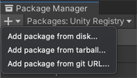

Input "com.unity.learn.iet-framework@3.1.1", click **Add** or press Enter, and repeat the same procedure using "com.unity.learn.iet-framework.authoring@1.2.1" as the input.

**NOTE:** Newer versions of both the framework and the authoring tools might be available, so you might want to check if they exist. You can do this by installing the versions listed here and then opening the package manager, clicking on the two packages, and checking for updated versions. 

To check if the packages were added correctly, look for the following: 

- Is there a **Tutorials** section in the top menu of Unity? 

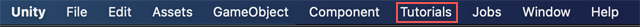

- Do the following tutorial-related options exist in the **Create** submenu?

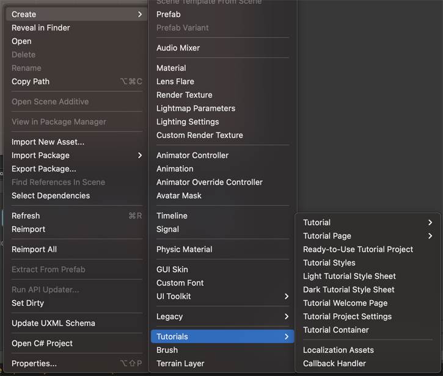

If you don't see the above, make sure your manifest.json file looks correct. 

## Project setup

Before you start working on the tutorials, it's recommended to configure your version control software to ignore the following files:
```
# Tutorial Framework has a backup option for the project's content, let's ignore the possible backup folder.
/Tutorial Defaults/
```

### How to set up the tutorial scaffolding

To create the ready-to-use tutorial scaffolding: 

1. Go to the Project window
1. Create a folder named `Tutorials` to help you stay organized
1. Enter this folder, then right-click and go to **Create** > **Tutorials** > **Ready-to-Use Tutorial Project**

This will create all the necessary files for the tutorial scaffolding:  

1. `Tutorial Project Settings`: the settings of the tutorial system that manages tutorials for this project
1. `Tutorial Welcome Page`: the welcome dialog displayed right after project startup
1. `Tutorials`: the table of contents of all tutorials 
1. `New Tutorial`: the table of contents of the first tutorial 
1. `5-StartPage`: a narrative-only tutorial page, which will be the first page of the new tutorial 
1. `10-TutorialPage`: a narrative + instructive tutorial page, which will be the second page of the new tutorial 
1. `15-LastPage`: a narrative + instructive + switch tutorial page, which will be the third page of the new tutorial 

Note: it's a good practice to number the tutorial pages. The default scaffolding uses only numbers 5, 10 and 15, so you can add easily additional pages between them.

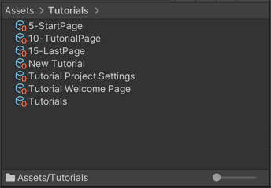

Unity's console window will display some warnings about what you have to set up manually. Clicking each warning will highlight its object and required actions. 

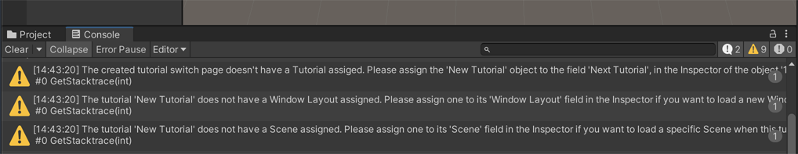

Next, create a new folder to keep the tutorial content organized, name it something like `Tutorial 1`, and put all the pages and the new tutorial there (items 4 through 7 in the list above).

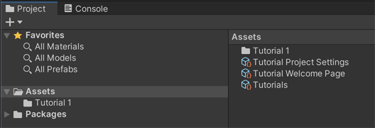

Finally, restart Unity. This will clear the fake scriptable object references in those files.  

### Testing the initial setup

Open the tutorial window by going to **Tutorials** > **Show Tutorials**

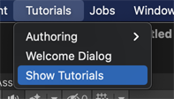

If everything is set up correctly, this window will appear: 

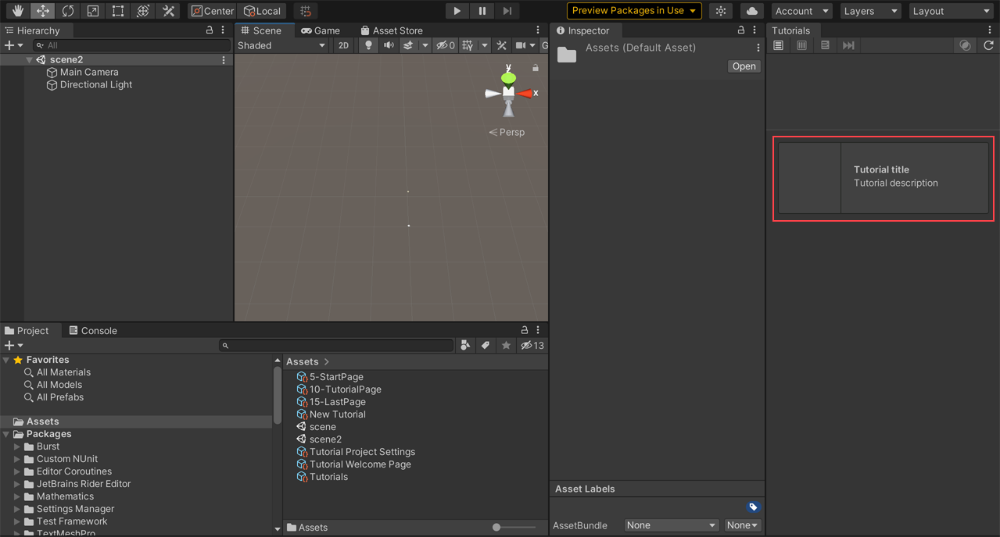

That is the visual representation of your Tutorial object, which is the table of contents. Currently, it displays only this first tutorial.

Try completing all the steps of this tutorial. If there are no errors, you're good to go! 

### Authoring toolbar

At the top of the tutorial window, you'll find the authoring toolbar. The function of each button is as follows:

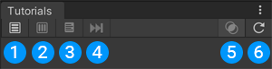

1. **Select Container** - select and inspect the current tutorial container asset
1. **Select Tutorial** - select and inspect the currently running tutorial asset
1. **Select Page** - select and inspect the current tutorial page asset
1. **Skip to End** - go to the last page of the tutorial
1. **Preview Masking** - toggle masking on and off, to preview or hide it
1. **Run Startup Code** - run project initialization (initial scene and camera settings), reload the **Tutorials** window, and show the welcome dialog (if configured)

## Creating new tutorial assets

### Adding a new tutorial

1. Create a new folder
1. Enter the folder, then right-click and go to **Create** > **Tutorials** > **Tutorial** > **Ready-to-Use Tutorial**

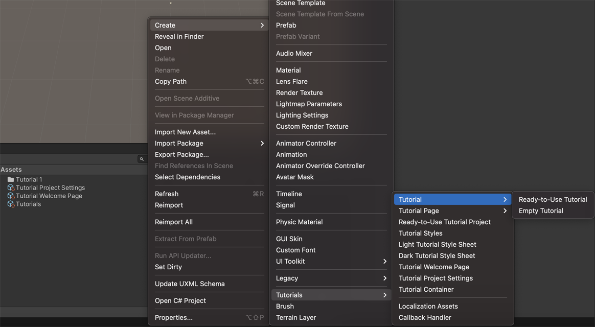

Remember to rename the tutorial file to distinguish it from the others.

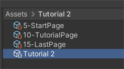

To enable analytics for your tutorial, select Progress Tracking Enabled. This will generate a unique Lesson ID (GUID) for your tutorial. You can check this GUID by selecting debug mode in the inspector window.

Edit any other fields you want to. 

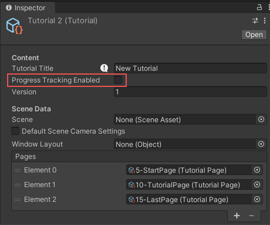

To add the tutorial to the table of content (Unity 2020): 

1. Go the Tutorial object and select it 
1. Expand its **Sections** array 
1. Add a new section 
1. Drag and drop the new tutorial asset into the **Tutorial** field of the new section 
1. Edit the other fields (**Heading**, **Text**, **Image**)
1. Use Ctrl/Cmd + S so that Unity saves the changes to your scriptable objects 
1. Test it! 


To add the tutorial to the table of contents (Unity 2019): 

1. Go the Tutorials object and select it 
1. Expand its **Sections** array
1. Increase the **Size** number to add a new section 
1. Drag and drop the new tutorial asset into the **Tutorial** field of the new section 
1. Edit the other fields (**Heading**, **Text**, **Image**)
1. Use Ctrl/Cmd + S so that Unity saves the changes to your scriptable objects 
1. Test it! 

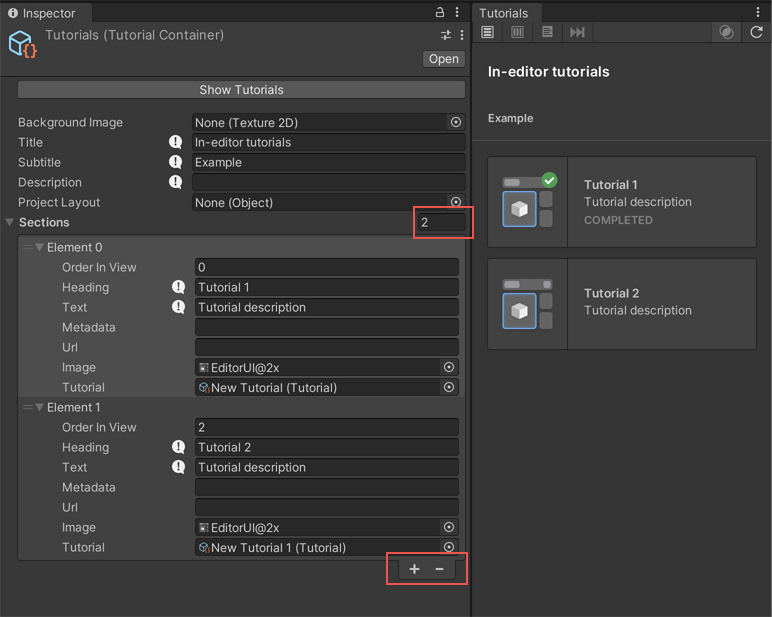

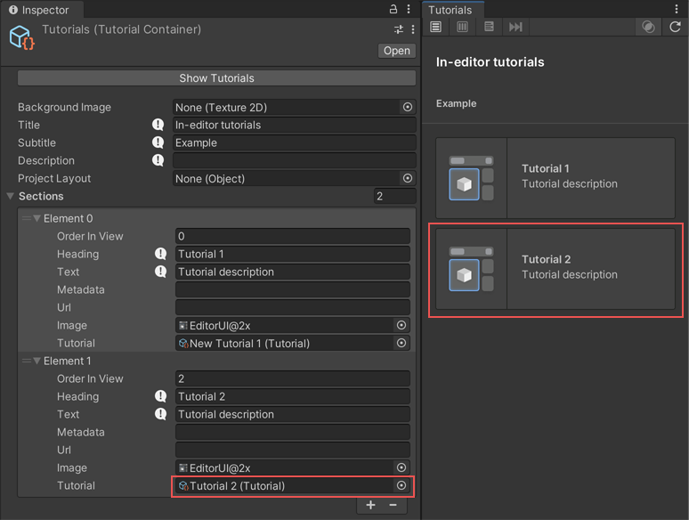

### Adding a page to an existing tutorial

1. Create a new page 

You can either duplicate an existing page and rename it, or use one of the menu items: right-click, then go to **Create** > **Tutorials** > **Tutorial Page**

2. Edit its fields 

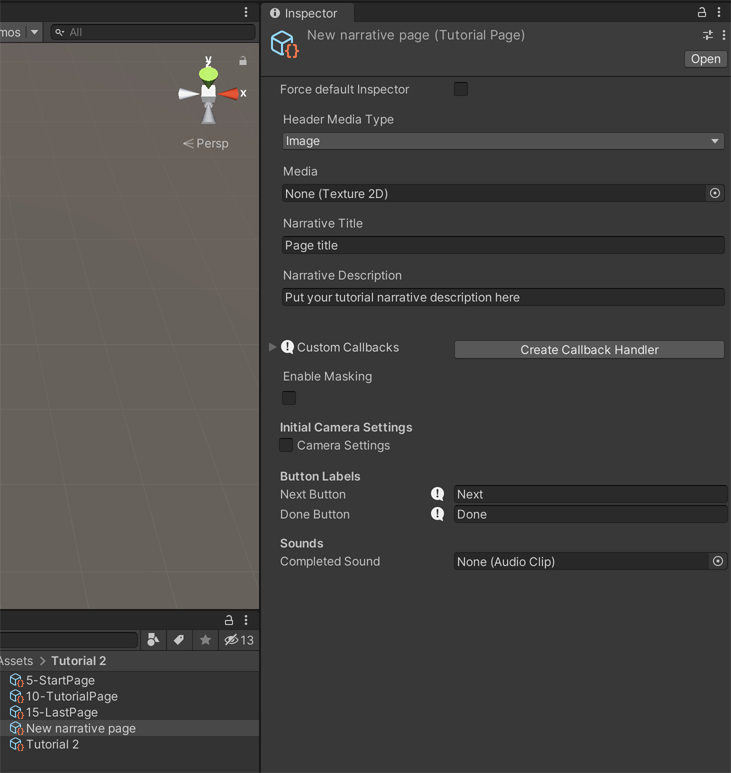

3. Click on the tutorial you want to add this page to, then add a new element to its **Pages** array 

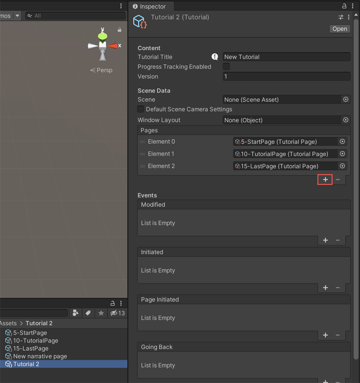

4. Reorder the elements according to where in the tutorial you want this page to appear 

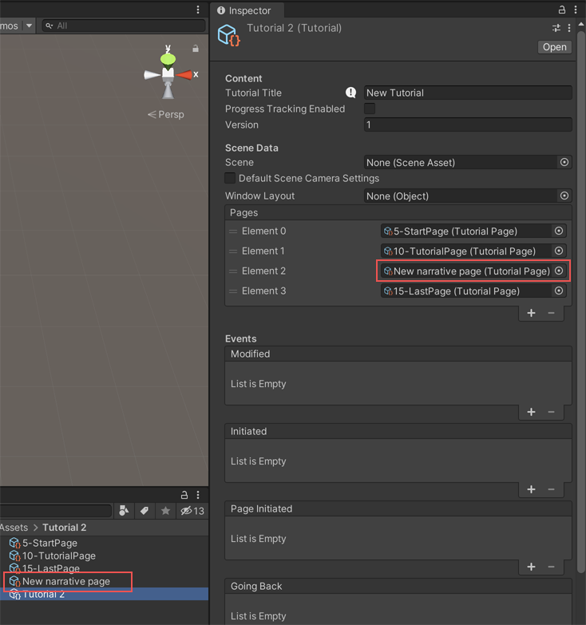

5. Save (Ctrl/Cmd + S)


### Adding an external link in the table of contents

**Use cases** 

1. you want to redirect the user to a webpage with more information about your project

**How-to**

1. Go to the `Tutorials` asset and select it 
1. Expand its **Sections** array 
1. Add a new section by increasing **Size**
1. Edit the fields (**Heading**, **Text**, **Image**). Be sure to put something in the URL field, and to clean up the **Tutorial** field (simply select it and press Delete)
1. Press Ctrl/Cmd + S so Unity saves the changes to your scriptable objects 
1. Test it! 

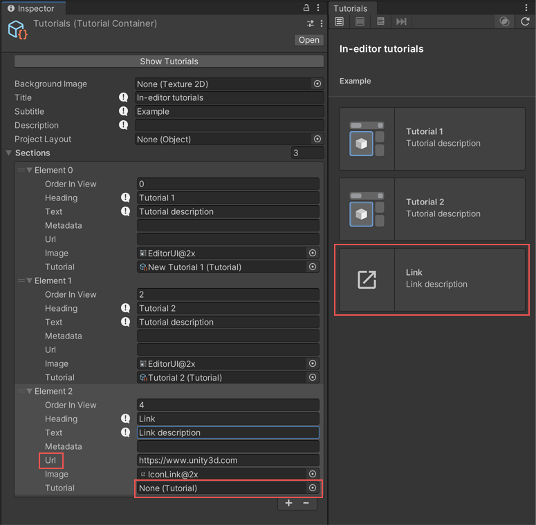


### Creating a tutorial category

**Use cases**

1. You want to organize your tutorials into categories, for example, "Beginner tutorials" and "Advanced tutorials".

**How-to**

<!-- TODO picture 1: BeginnerTutorials selected, Title set, Sections set to 1, "Tutorial 1" set as the tutorial -->
<!-- TODO picture 2: Tutorials window showing the container which has 2 categories and everything else set up -->

This example assumes that you have an existing tutorial project. See [How to set up the tutorial scaffolding](#how-to-set-up-the-tutorial-scaffolding).

1. Rename your original tutorial container, `Tutorials` asset, to `TutorialProject`.
1. Create a new folder, `Assets/Tutorials/Beginner`, and enter it.
1. Go to **Create** > **Tutorials** and select **Tutorial Container**. Rename the created `Tutorials` asset to `BeginnerTutorials`.
1. Select the asset and input "Beginner tutorials" as the **Title** using the Inspector.
1. To create a new section, increase the value of **Sections** from 0 to 1 
1. Select (drag and drop or use an object picker) an existing tutorial, for example, `Tutorial1`, as the **Tutorial** of the new section.
1. Provide the section's **Heading** and **Text** with suitable descriptions.
1. Select `TutorialProject` as the container's **Parent Container**.
1. Set the `BeginnerTutorials` container's **Order In View** to 0. This will make it the first item in the parent container.
1. Repeat the aforementioned steps for a new container, `AdvancedTutorials`, using `Assets/Tutorials/Advanced` folder.
1. Set the `AdvancedTutorials` container's **Order In View** to 1. This will make it the second item in the parent container.
1. Select your original tutorial container, `TutorialProject`, to view the categories you just added to it.
1. Set **Order In View** values of **Sections** to begin from 2. This will make it the third item in the parent container.
1. Your tutorial project (`TutorialProject` asset) should now contain "Beginner tutorials" and "Advanced tutorials" categories. Any other content is shown below the category cards.

## Masking and highlighting

**Note:**

Masking and highlighting always go together. What is not masked is highlighted, and vice versa. 

Masking can be edited at runtime (while the tutorial is running). Just disable **Preview Masking** (see instructions below), make the changes and then enable it again. 

Masking won't be re-applied when navigating to a previous tutorial step (clicking **Back**) 

**Use cases**

1. To highlight a specific part/window of the Editor, for example, the Inspector, or to mask and block interactions with it
1. To highlight a specific control, for example, the Play button in the top bar, or to mask and block interactions with it
1. To highlight a specific property in the Inspector, a specific label, or a specific object in the Scene view or Project window

**How-to**

**Enable masking:**

1. Select the tutorial page you want to apply masking / highlighting to 

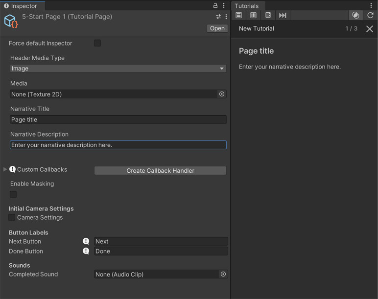

2. Enable the **Enable Masking** checkbox and make sure **Preview Masking** is enabled

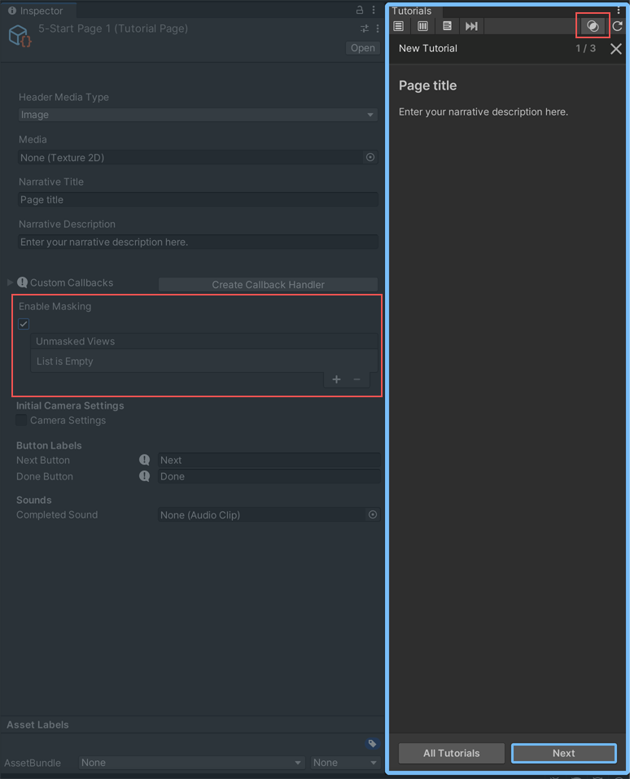

If no unmasked views are selected, the tutorial window will be masked. 

**To highlight an object in the scene:**

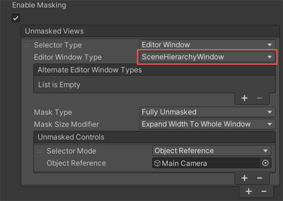

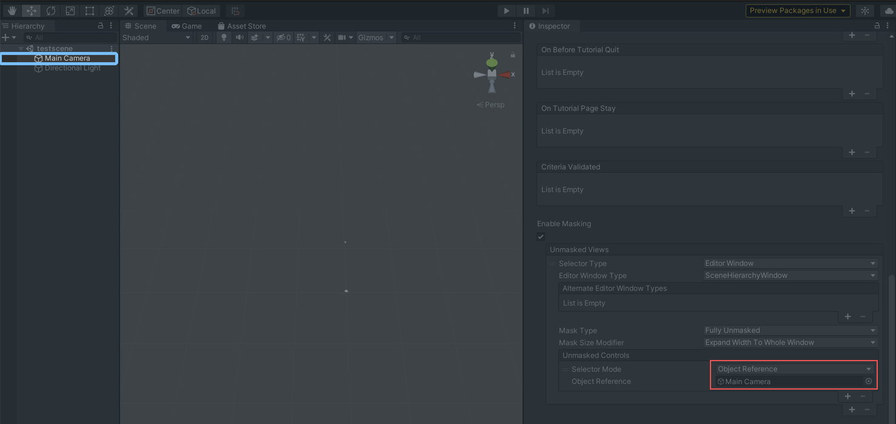

- You can reference scene objects in the scene. 
- When switching between scenes while referencing objects, the reference will temporarily be marked as missing, but it will reappear as soon as you get back to the scene where the object lives. 
- You can reference child objects, but they won't be highlighted. 

**To highlight an object in the Project window:**

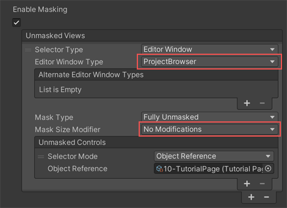

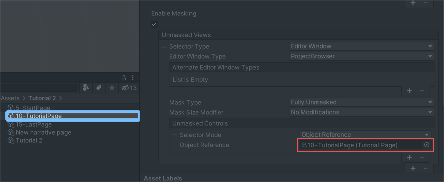

**To highlight an object that is instantiated during the tutorial:**

Read more about this topic from [here](https://docs.unity3d.com/Packages/com.unity.learn.iet-framework@2.0/manual/framework-documentation.html#future-prefabs-and-criteria).

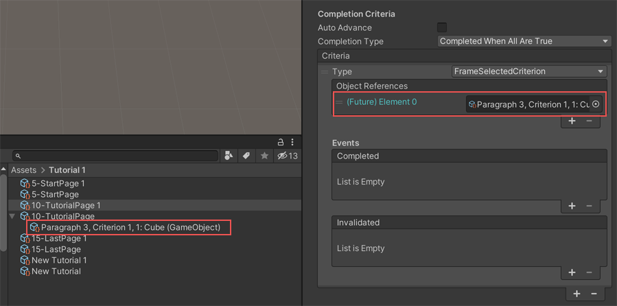

For other masking setups and examples, check out [this](https://docs.unity3d.com/Packages/com.unity.learn.iet-framework@2.0/manual/framework-documentation.html#masking-settings) and the Microgame tutorials.

## Executing code when a page loads

**Use cases**

1. To set up the beginning of a specific tutorial step so that the user can more easily perform a task and proceed, for example, open a window for the user, ping an object in the Project window, instantiate an object, toggle a tool, and so on
1. To enable/disable something, such as a custom tool, that would allow/prevent the user to/from completing the tutorial, the LEGO® Tools in the LEGO® Microgame being an example
1. You want to ensure that the user has something to do in the tutorial, for example set the value of a property of a GameObject's component so the user has to change it to proceed

**How-to**

**Create the TutorialCallbacksHandler:**

To execute arbitrary code when a tutorial page is run, you need to create a TutorialCallbacksHandler: 

1. Select a tutorial page 
2. Click on the **Create Callback Handler** button in the Inspector 

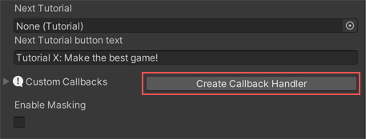

3. Save it in your project (the `Tutorials` parent folder is recommended, if you want to keep everything in one place) 

At this point, 2 files will be generated: 

1. A `TutorialCallbacks(.cs)` script in the folder you selected 
1. A `TutorialCallbacks(.asset)` scriptable object next to the tutorial page you used to create it (you can move it to the `Tutorials` folder) 

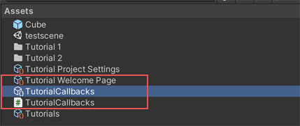

**NOTE:** you only need to generate the handler the first time. From the second time, you just add methods. 

**Add custom methods to TutorialCallbacksHandler:**

Open the script so you can edit it and add the custom **(and public)** methods that you want to call from the tutorials. The script already provides some example methods.

After you finish adding the methods: 

1. Save the script from your code editor 
1. Go back to Unity 
1. Click on the tutorial page that is going to execute the methods 
1. Expand the **Custom Callbacks** section in the Inspector 
1. Click the **Add** (**+**) button.

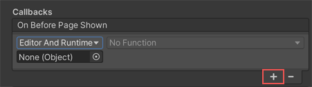

6. Drag and drop the **TutorialCallbacks** scriptable object onto the object field 

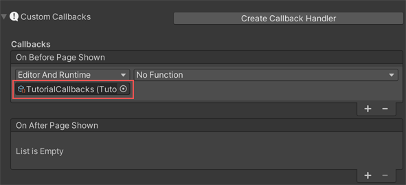

7. Set the execution type as **Editor And Runtime** (unless you have some very specific other use case) 
8. Click on the **No Function** field and select the method that you want to run

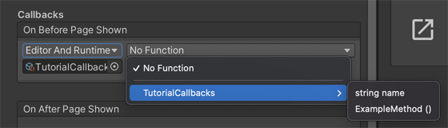

9. Save (Ctrl/Cmd + S) and test that the code is run when you reach that tutorial page in a tutorial 

## Using the CommonTutorialCallbacksHandler

IET comes with a `CommonTutorialCallbacksHandler` asset which contains some commonly needed utility functions for authoring tutorial logic. You can use this in combination with the other handlers that you define in the project. 

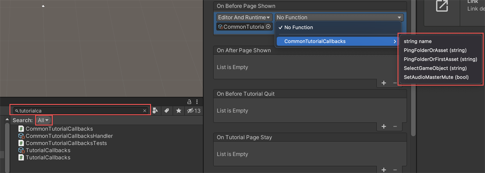

**Use case**

You want the user to perform certain actions during a tutorial in order to proceed to the next tutorial step (for example, click on an object, delete an object, instantiate something, select a tool, etc.)

**How-to**

1. Create a narrative + instructive page by right-clicking and going to **Create** > **Tutorials** > **Tutorial Page**, or select an existing one, then add it to the tutorial (read [here](#adding-a-page-to-an-existing-tutorial) if you don't remember how)
1. Select the page and add a new condition in the **Completion Criteria** section 


3. Select the criterion you're looking for, if available. (You can find a description of each available criterion [here](https://docs.unity3d.com/Packages/com.unity.learn.iet-framework@2.0/manual/framework-documentation.html#criteria-descriptions). If none of the available criteria satisfy your needs, you can define your own criteria (see *Defining your own completion criteria* below).

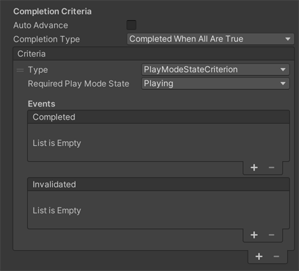

4. Save and run the tutorial to test that your criteria is met (the user won't be able to proceed further in the tutorial until the criteria condition is met) 

**Defining your own completion criteria**

**Use case**

You want to check if the user has performed an action (such as enabling an option in your custom tool) or reached a particular state (such as published a game through the WebGL Publisher), but there's no criteria that checks for the same thing you're looking for.

**How-to**


1. In your callbacks handler, define a `public` method that returns a `bool` This will be your "criterion method", and it will be called every frame while the tutorial page is running. For example:
```
    public bool DoesFooExist()
    {
        return GameObject.Find("Foo") != null;
    }
```

2. Follow the steps listed above, but select **ArbitraryCriterion** as the **Type**
2. Drag and drop the callbacks handler that contains the criterion method onto the **Callback** field  
2. Select the method you created

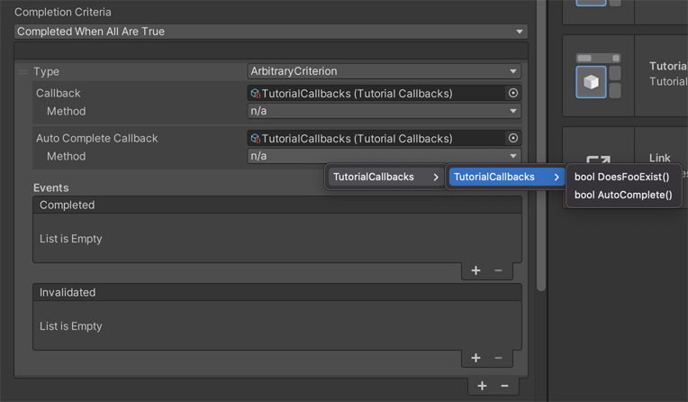

5. Save and test 
5. You can also set up an **Auto Complete Callback** if you want to be able to skip the page while authoring

**Implementing your own criterion class**

`ArbitraryCriterion` is fast and easy way to utilize simple criteria. For more complex criteria, one can consider implementing their own criteria by creating a class that inherits from the
[Criterion](https://docs.unity3d.com/Packages/com.unity.learn.iet-framework@2.0/api/Unity.Tutorials.Core.Editor.Criterion.html) class. Your criterion will appear automatically as one of the **Type** options.

## The welcome dialog

**Use case** 

You want to welcome users to the tutorials when they open the project for the first time, either to give them information about what they'll find in the project or to let them choose a starting point, for example, an option to either ignore or start the tutorials in the project.

**How-to**

By default, every project has a welcome dialog. It is displayed only the first time the project is open but the user can revisit it by selecting **Tutorials** > **Welcome Dialog**.

You can choose which welcome dialog to display by setting this field in the **Tutorial Project Settings** object.


**Edit the welcome dialog:**

1. Select the dialog object 
1. Edit the fields through the Inspector 
1. Close the dialog 
1. Reopen by going to **Tutorials** > **Welcome Dialog** to view the changes

You can also add more buttons to the welcome dialog by editing the **Buttons** property and adding new callbacks defined in a custom scriptable object (or in your TutorialCallbacksHandler) 

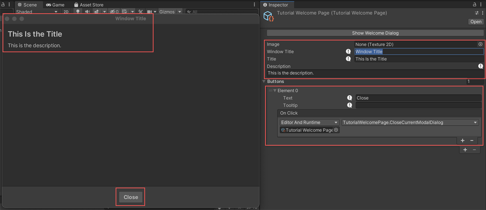

## Custom Window Layouts

**Use cases**

1. To ensure that a specific window layout is loaded when the project opens for the first time, or when the Tutorials window is opened 
1. To ensure that a specific layout is loaded when a tutorial is started so the prerequisites for the tutorial are satisfied

a. NOTE: Loading layouts is an intrusive operation; for an alternative and less intrusive approach for opening specific Editor windows, pinging assets, and accomplishing other prerequisites see [this](#executing-code-when-a-page-loads).

**How-to**

1. Prepare the layout on your local Unity instance, docking windows, defining zoom and active folders in the Project window, etc.
1. When you're ready, select **Tutorials** > **Layout** > **Save Current Layout to Asset** and save the layout

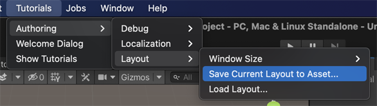

3. Save the asset in a folder and restart Unity (this is necessary to avoid problems with layout reload) 

**To set the layout as a project layout:**

1. Click on the Tutorials object 
2. Assign the saved file to the **Project Layout** field 

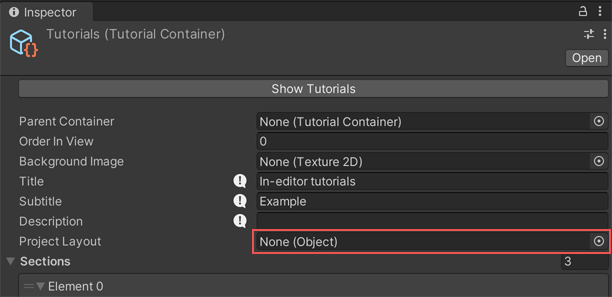

**To set the layout as tutorial-specific layout:**

1. Click on the object that represents the tutorial 
2. Assign the saved file to the **Window Layout** field 

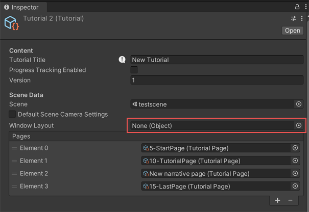

6. Save your changes and test them.

## Custom IET style sheets 

**Use case**

You want to override the default dark / light themes of IET

**How-to**

1. Use the **Create** > **Tutorials** menu items provided to create a new **Tutorial Styles**, **Light Tutorial Style Sheet** and **Dark Tutorial Style Sheet**

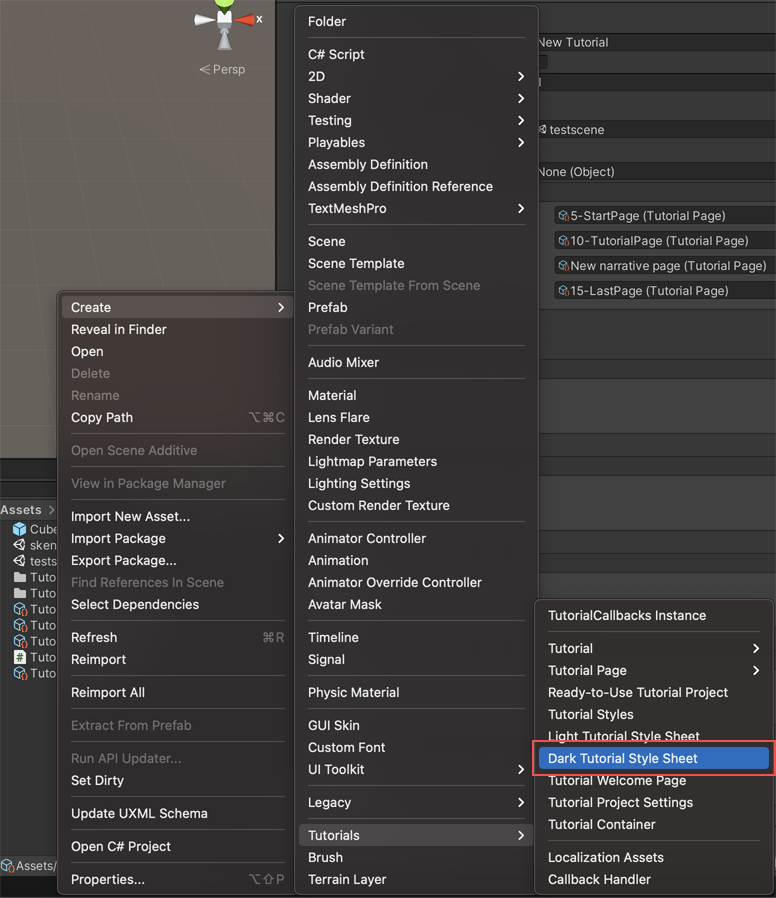

2. Assign the light and dark style sheets to the new tutorial styles asset

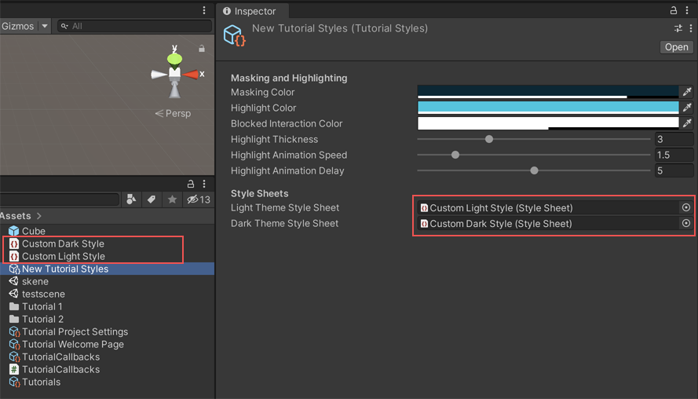

3. Assign the new tutorial styles to the **Tutorial Project Settings**

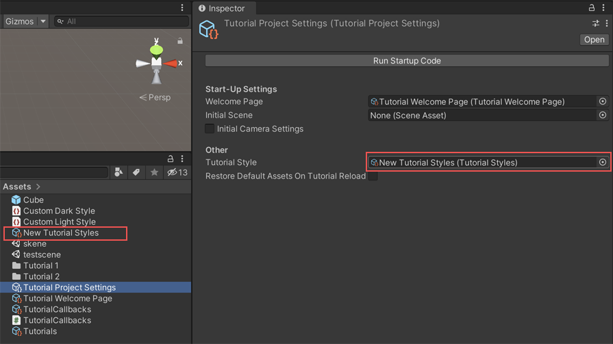

4. Save and test (run a tutorial or reopen the tutorial window) 

## Rich text support

Some HTML tags and character codes are supported: See reference [here](https://docs.unity3d.com/Packages/com.unity.learn.iet-framework@2.1/manual/framework-documentation.html#using-rich-text-in-tutorial-instructions-and-narratives)

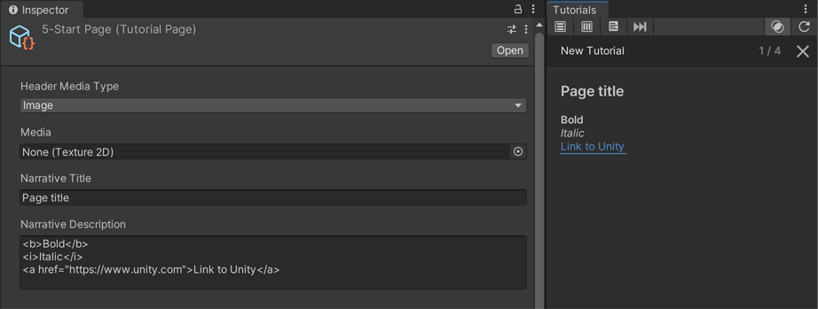

## Content localization

The content displayed in IET can be localized. In order to do so:
1. Move to an existing `Editor` folder in your project (or create a new one)
1. Right-click and go to **Create** > **Tutorials** > **Localization Assets**. This will create a `Localization` folder in your current location
1. Go to **Tutorials** > **Localization** > **Extract Localizable Strings for the Project** and choose the `Localization` folder you created in the previous step. This will create the localization files for all supported languages
1. Right-click any of the generated .po files and click **Show in Explorer**
1. Open the selected file with a text editor
1. Replace the empty `msgstr` strings associated to each `msgid` with the localized strings you want to display
1. When you're done with your changes, save the edited file and go back to the Unity Editor

To test your changes:

1. Change the editor language from **Edit** > **Preferences** > **Languages**. If you don't see this menu, you probably need to install the **Language Packs** for the Unity Version you're using, through the Unity Hub.
1. Agree to restart the Editor
1. Run the localized tutorial and check that the localized version of the content is displayed

**NOTE:** Use **Tutorials** > **Localization** > **Translate Current Project** to apply any subsequent changes in .po files

**NOTE 2:** It is possible to edit the localized content in realtime, while a tutorial is running. All you need to do is editing the content of .po files, and save the changes in your text editor.

**NOTE 3:** Every time you change the English content of a tutorial, which resides in the tutorial file itself and can be edited through the Inspector window, you need to update the corresponding `msgid` in .po files to not break the localization for non-English languages. 

## More tips

1. Always close a running tutorial by completing it OR pressing the **Close** (**X**) near its page count. Exiting it in another way might lead to unexpected problems. 
1. You can edit tutorials while they're running, but be careful about changing the completion criteria of a current tutorial page. In that specific case, It is better if you select the current page, then click **Back**, change what you want to change, and then proceed to the page again. Doing this will also retrigger the custom callbacks that are set to be called when the page is displayed.
