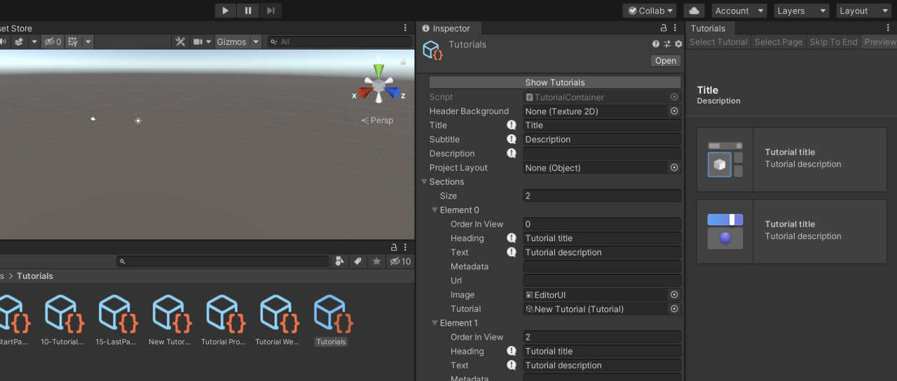

# About Tutorial Authoring Tools

This package is used to author interactive in-Editor tutorials (IET) in tutorial projects and project templates. This package provides only UI functionality and no public APIs.

This package should be used while developing tutorials, but the final published tutorial project should not typically include this package as a dependency.

## Installation
For Unity 2021.2 and newer, simply search for "Tutorial Authoring Tools" in the Package Manager. For older Unity versions, this package is not currently discoverable,
and you need to add the following line to the `dependencies` list of `Packages/manifest.json`:  
`"com.unity.learn.iet-framework.authoring": "1.2.1"`

Make sure the framework and the authoring tools have compatible versions, which are most likely the latest versions of each package.

## Requirements

This version of Tutorial Authoring Tools is compatible with the following versions of the Unity Editor:

* 2020.3 and later (LTS versions recommended)
