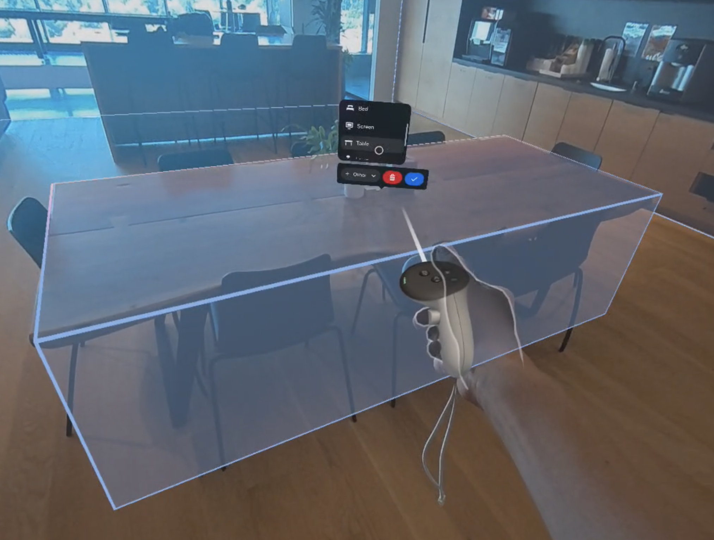

# Session

This page is a supplement to the AR Foundation [Session](xref:arfoundation-session) manual. The following sections only contain information about APIs where Meta Quest exhibits unique platform-specific behavior.

[!include]

## Scene capture

Unlike other AR platforms, Meta OpenXR does not dynamically detect trackables at runtime. Instead, Meta's OpenXR runtime queries the device's Space Setup data and returns information stored in its [Scene Model](https://developer.oculus.com/documentation/native/android/openxr-scene-overview#scene-model). In the Meta OpenXR API, this Space Setup process is referred to as _scene capture_.

During scene capture, the device presents an interface where users can label surfaces and objects in their environment such as walls and furniture. When scene capture is complete, the Scene Model is saved to the device and persists across applications and sessions.

 *Scene capture shown on a Quest 3.*

> [!NOTE]
> The user interface for scene capture varies depending on which Meta Quest device is used, but all devices support the same OpenXR API.

The user can initiate scene capture any time via the [Space Setup](xref:meta-openxr-device-setup#space-setup) option in Settings, and your app can also initiate scene capture any time via the scene capture API.

> [!TIP]
> Due to current limitations of tracking technology, it is possible that detected planes and other trackables can become misaligned with their physical counterparts over the duration of an AR session. As a workaround for this issue, you can give users the option to initiate scene capture from within your app, allowing them to realign the bounding boxes of trackables in their space.

### Life cycle

The scene capture life cycle consists of four phases:

1. You request to initiate scene capture.
2. If the request was successful, on a subsequent frame Unity invokes [MonoBehaviour.OnApplicationPause(bool)](xref:UnityEngine.MonoBehaviour.OnApplicationPause), passing `true`. Your app is suspended during scene capture.
3. The user completes scene capture as prompted by the device.
4. Unity resumes and invokes `OnApplicationPause` again, passing `false`.

### Code sample

Use [MetaOpenXRSessionSubsystem.TryRequestSceneCapture](xref:UnityEngine.XR.OpenXR.Features.Meta.MetaOpenXRSessionSubsystem.TryRequestSceneCapture) to initiate scene capture, as shown below:

[!code-cs[meta_scene_capture](../../Tests/CodeSamples/MetaSceneCaptureSample.cs#meta_scene_capture)]
