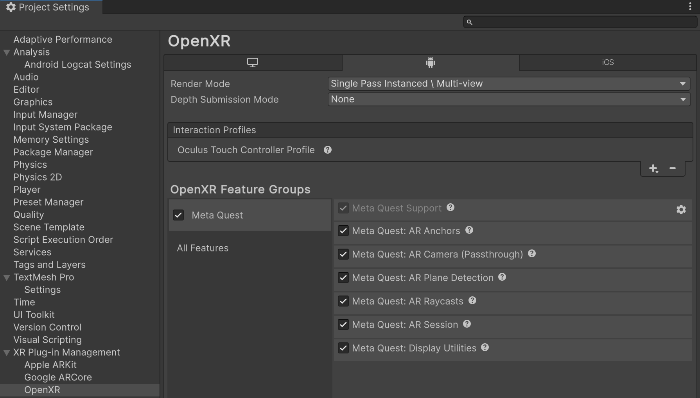
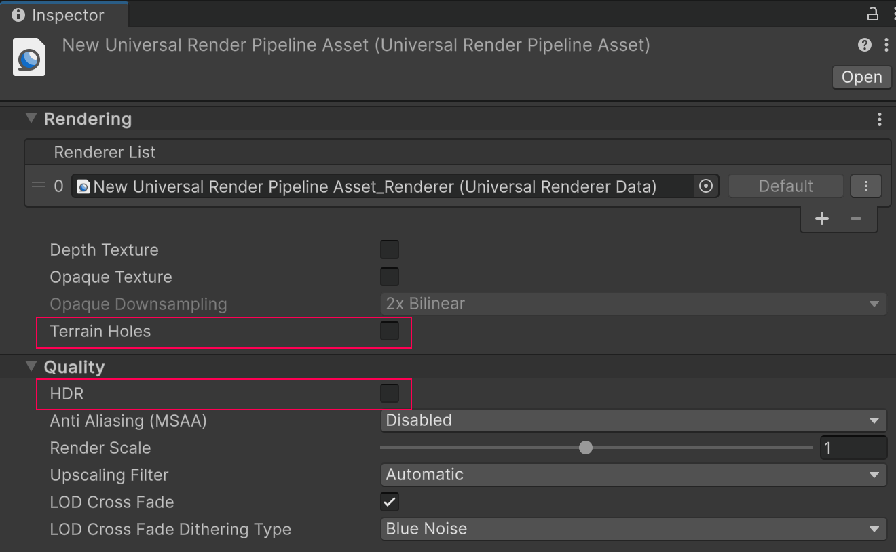
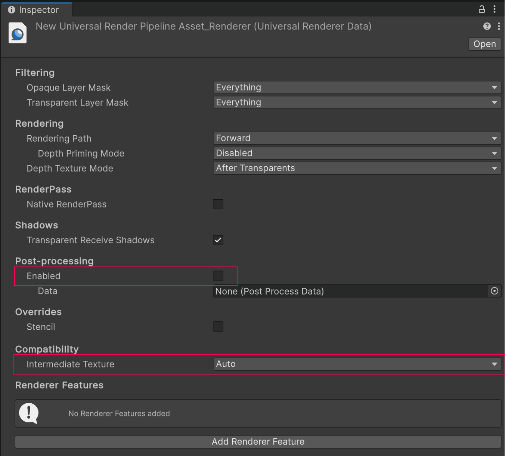

# Project setup

To enable the Unity OpenXR: Meta in your project, follow the steps below:

1. Go to **Edit** > **Project Settings...** > **XR Plug-in Management**.
2. In the Android tab, under **Plug-in Providers**, enable **OpenXR**.
3. While still in the Project Settings window, go to **XR Plug-in Management** > **OpenXR**.
4. In the Android tab, under **Interaction Profiles**, add **Oculus Touch Controller Profile**.
5. Under **OpenXR Feature Groups**, enable the **Meta Quest** feature group.

 *The Meta Quest OpenXR feature group*

> [!NOTE]
> XR Plug-in Management supports only one enabled plug-in provider at a time per build target. If your project also targets ARCore using the [Google ARCore XR Plug-in](https://docs.unity3d.com/Packages/com.unity.xr.arcore@5.0), to avoid errors you should disable the **Google ARCore** plug-in provider before you build an APK for Meta Quest devices. Likewise, you should disable **OpenXR** before you build for ARCore.

## Scene setup

To set up your scene for Meta OpenXR, first follow the standard AR Foundation [scene setup](https://docs.unity3d.com/Packages/com.unity.xr.arfoundation@5.0?subfolder=/manual/project-setup/scene-setup.html). If your scene will use the Meta Quest device's Passthrough camera, see the additional information below.

Ensure that the **Tracked Pose Driver** component on your camera is has "centerEyePositon [XR HMD]" included in the position and rotation input actions.

### Camera clear flags

Meta Passthrough requires that your Camera's **Clear Flags** are set to **Solid Color**, with the **Background** color alpha channel value set to zero.

If you have completed AR Foundation scene setup, follow these instructions to set your Camera's **Clear Flags**:

- Your GameObject hierarchy should contain a GameObject named **XR Origin**. Expand its children to reveal the **Camera Offset** and **Main Camera** GameObjects.
- Inspect the **Main Camera** GameObject.
- The Camera component's **Clear Flags** should already be set to **Solid Color**. Select the **Background** color to open the color picker.
- Set the color's **A** value to 0.

Your scene is now configured to support Meta Passthrough.

## Universal Render Pipeline

Meta Quest is compatible with the Universal Render Pipeline (URP), but the default URP settings are not suitable for best Passthrough performance on Quest. Refer to the table below for a list of Unity's recommended settings, which are explained in greater detail in the following sections.

| Setting                  | Location                                          | Recommended value |
| :----------------------- | :------------------------------------------------ | :---------------- |
| **Graphics API**         | **Project Settings** > **Player**, Other Settings | **Vulkan** |
| **Terrain Holes**        | Universal Render Pipeline Asset                   | Disabled |
| **HDR**                  | Universal Render Pipeline Asset                   | Disabled |
| **Post-processing**      | Universal Renderer Data                           | Disabled |
| **Intermediate Texture** | Universal Renderer Data                           | **Auto** |

### Vulkan Graphics API

Unity recommends that you use the Vulkan Graphics API with URP. Vulkan currently supports the greatest number of configurations with functional Passthrough. Due to current limitations of URP, Vulkan is also required to support Passthrough in development builds.

Follow the steps below to change your project's Graphics API to Vulkan:

1. Go to **Edit** > **Project Settings** > **Player**.
2. On the Android tab, under **Other Settings**, click the **Add** button (**+**) to add a new Graphics API.
3. Select `Vulkan`.
4. Re-order the Graphics API's using the handles (**=**) so that Vulkan is listed first.

### Universal Render Pipeline Asset settings

Follow the steps below to optimize your Universal Render Pipeline Asset for Meta Quest:

1. Locate your project's Universal Render Pipeline Asset. One way to do this is to type `t:UniversalRenderPipelineAsset` into the Project view's search bar.

    > [!TIP]
    > If your project does not contain a Universal Render Pipeline Asset, refer to [Installing the Universal Render Pipeline into an existing Project](https://docs.unity3d.com/Packages/com.unity.render-pipelines.universal@14.0/manual/InstallURPIntoAProject.html) from the URP docs.

2. In the Inspector, under the **Rendering** header, disable **Terrain Holes**.
3. Under the **Quality** header, disable **HDR**.

 *Universal Render Pipeline Asset shown with recommended settings*

### Universal Renderer Data settings

Follow the steps below to optimize your Universal Renderer Data for Meta Quest:

1. Locate your project's Universal Renderer Data Asset. One way to do this is to type `t:UniversalRendererData` into the Project view's search bar.
2. In the Inspector, under the **Post-processing** header, uncheck **Enabled**.
3. Under the **Compatibility** header, set the **Intermediate Texture** value to **Auto**.

 *Universal Renderer Data shown with recommended settings*
